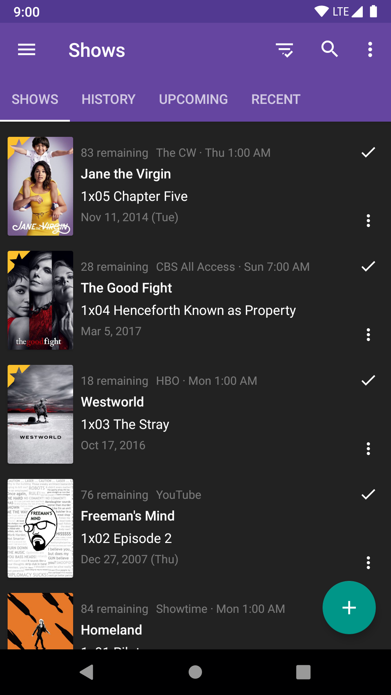

<h1 align="center">SeriesGuide</h1>

Android app to help you keep track of your favorite TV shows and movies.

  <a href="https://seriesgui.de">Download</a> •
  <a href="https://seriesgui.de/whypay">Support the dev</a> •
  <a href="CONTRIBUTING.md">Contributing</a> •
  <a href="https://discuss.seriesgui.de/">Help & Ideas</a>

  
  
  

  

## License

Except where noted otherwise, this work by [Uwe Trottmann](https://uwetrottmann.com) is licensed under the [Apache License 2.0](LICENSE.txt).

Code [contributors](https://github.com/UweTrottmann/SeriesGuide/graphs/contributors) and changes are tracked by Git.
Translation [contributors](https://crowdin.com/project/seriesguide-translations/activity_stream) are tracked by Crowdin.
