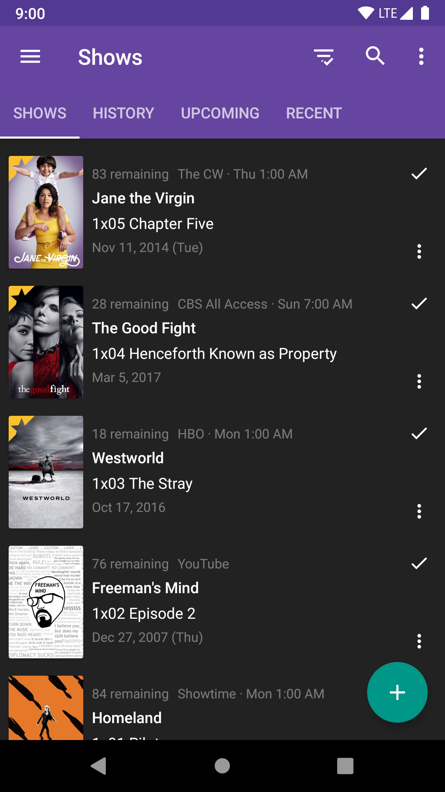

# SeriesGuide

Android app to help you keep track of your favorite TV shows and movies.

[Download](https://www.seriesgui.de) 
• [Support the dev](https://www.seriesgui.de/whypay) 
• [Contribute](CONTRIBUTING.md) 
• [Announcements & Help](https://discuss.seriesgui.de/) 
• [Release notes](https://github.com/UweTrottmann/SeriesGuide/blob/main/CHANGELOG.md#release-notes)

## License

Except where noted otherwise, this work by [Uwe Trottmann](https://www.uwetrottmann.com) is licensed
under the Apache License 2.0, see [LICENSE.txt](LICENSE.txt).
Each relevant file contains an [SPDX short-form identifier](https://spdx.dev/learn/handling-license-info/)
at the first possible line with the `Apache-2.0` value.

Code [contributors](https://github.com/UweTrottmann/SeriesGuide/graphs/contributors) and changes are tracked by Git.
Translation [contributors](https://crowdin.com/project/seriesguide-translations/activity_stream) are tracked by Crowdin.
